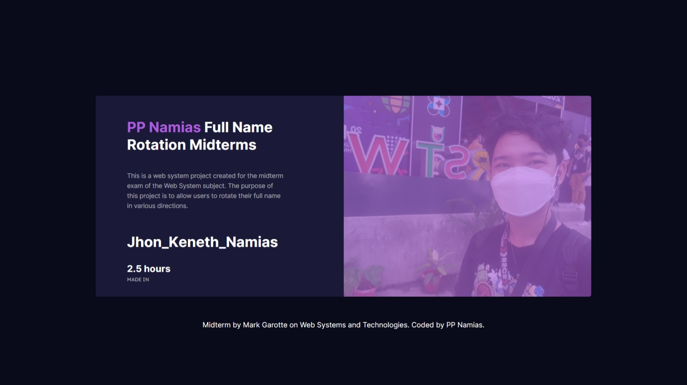

  
  <h1 align="center"><b>Full Name Rotation</b></h1>

  
  
   
  
  
  
  
  
  
  

    This is a web system project created for the midterm exam of the Web System subject. The purpose of this project is to allow users to rotate their full name in various directions.
     
     
    <a href="https://github.com/PP-Namias/Full-Name-Rotation/issues">Report Bug</a>
    ·
    <a href="https://github.com/PP-Namias/Full-Name-Rotation/issues">Request Feature</a>
  

<!-- ABOUT THE PROJECT -->
##  》Description

##  》Screenshots
 

  

## ✨》Donate
By Donating, You Will Help Me To Maintain This Project 
- [Patreon](https://www.patreon.com/PP_Namias)
- [Ko-fi](https://ko-fi.com/PP_Namias)

## 🔐 》License
Distributed under the MIT License. See [`LICENSE`](https://github.com/PP-Namias/Full-Name-Rotation/blob/main/LICENSE) for more information.
